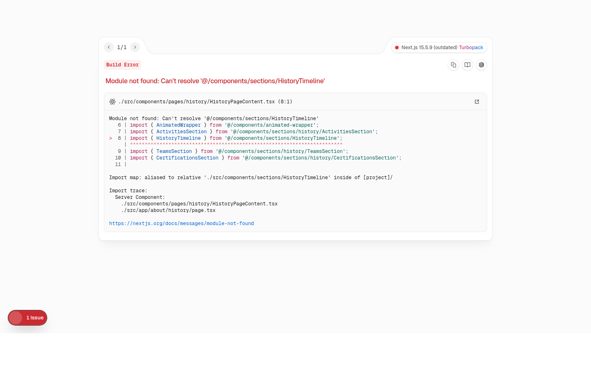
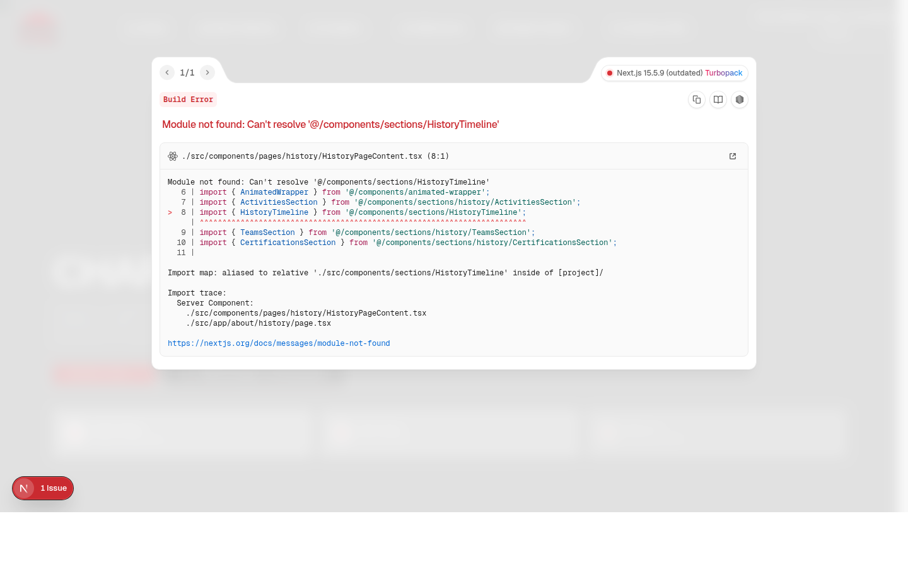
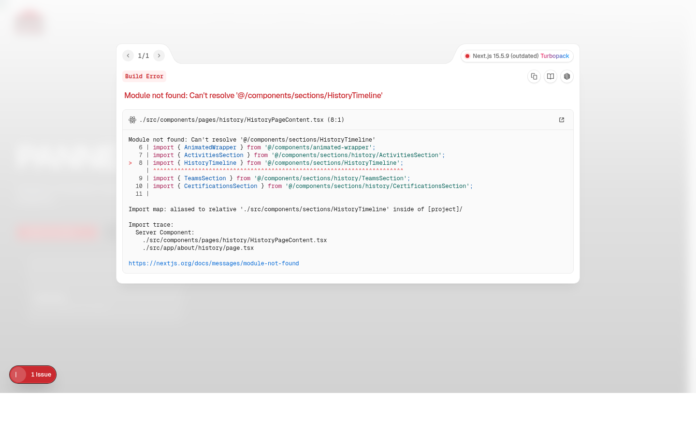
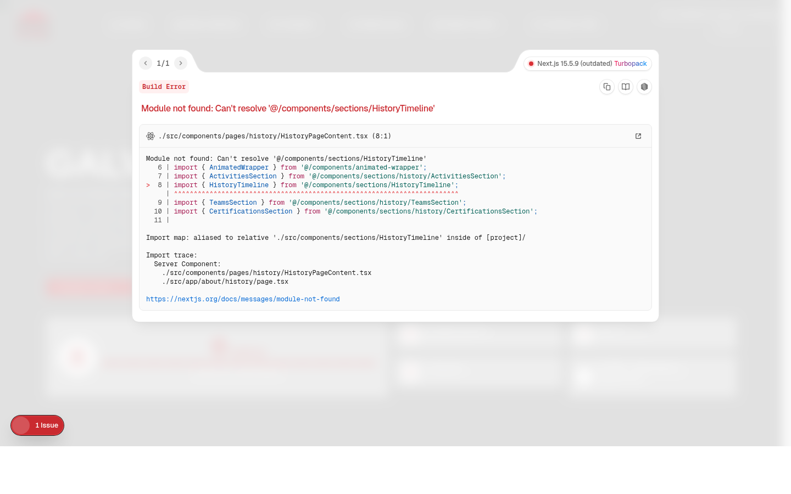
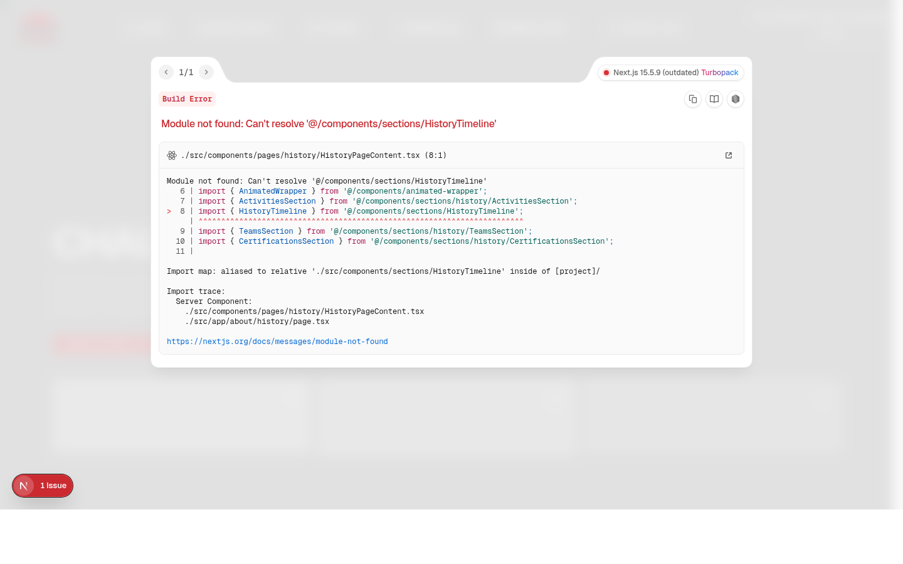
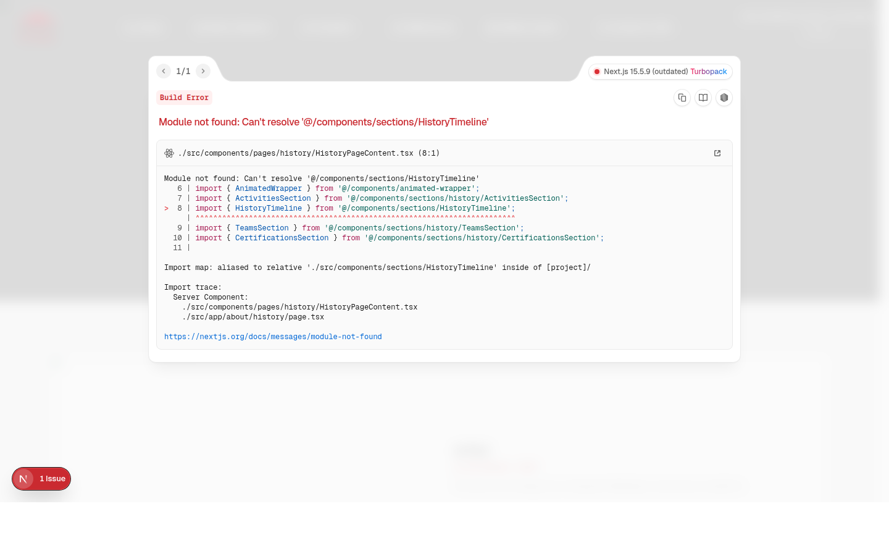

<div align="center">


# BORDJ STEEL — Site Web Officiel

**Projet professionnel livré · Secteur industriel / Construction métallique · Algérie**


</div>

---

Ce dépôt contient le code source du **site web officiel de SPA BORDJ STEEL**, entreprise spécialisée dans la construction métallique et la fabrication d'acier, filiale du Groupe CONDOR.

Ce projet a été conçu, développé et livré en tant que **commande professionnelle**. Il constitue la **vitrine digitale principale** de BORDJ STEEL — une plateforme de production réelle, pas une démo.

> **Statut du projet : Livré et archivé.**
> Ce dépôt représente l'état final du projet tel qu'il a été remis au client.

---

## Aperçu du Site

| Page | Capture |
|------|---------|
| **Accueil** |  |
| **Notre Histoire** |  |
| **Charpente Métallique** |  |
| **Panneaux Sandwich** |  |
| **Galvanisation à Chaud** |  |
| **Chaudronnerie** |  |
| **Références** |  |
| **Contact** |  |
| **Media Center** |  |

---

## Ce que le Site Couvre

Le site est conçu pour présenter :

- Les systèmes de construction métallique (charpente, panneaux sandwich, galvanisation, chaudronnerie)
- Les variantes techniques et spécifications produits
- L'histoire et le positionnement de l'entreprise
- Les références et projets réalisés
- Les points d'entrée pour le contact et les demandes commerciales

Il est **purement informationnel et orienté branding**.

### Hors périmètre (intentionnel)

| Fonctionnalité | Statut |
|---|---|
| E-commerce | Hors scope |
| ERP / outils internes | Hors scope |
| Authentification utilisateurs | Hors scope |
| Tableaux de bord / admin | Hors scope |

---

## Stack Technique

| Couche | Technologie |
|--------|-------------|
| Framework | Next.js 15 (App Router) |
| Langage | TypeScript |
| Interface | React + shadcn/ui |
| Styles | Tailwind CSS |
| Animations | Framer Motion |
| Hébergement | Firebase App Hosting |
| IA (expérimental) | Genkit / Google AI |

---

## Structure du Projet

```text
src/
├─ app/                  # Next.js App Router — routes publiques
├─ components/           # Composants React réutilisables
│  ├─ ui/                # Primitives shadcn/ui
│  ├─ sections/          # Sections de page (hero, about, etc.)
│  ├─ shared/            # Composants partagés (navbar, footer)
│  └─ product-variants/  # Logique de rendu des variantes produit
├─ config/               # Contenu statique et configuration
├─ hooks/                # Hooks React personnalisés
├─ lib/                  # Utilitaires et assets statiques
├─ ai/                   # Code Genkit / IA
public/                  # Assets statiques (logos, images)
docs/
└─ screenshots/          # Captures d'écran du site final
```

---

## Développement Local

**Prérequis :** Node.js 18+

```bash
# Installer les dépendances
npm install

# Lancer le serveur de développement
npm run dev
```

L'application tourne sur : `http://localhost:9002`

```bash
# Vérification TypeScript
npm run typecheck

# Linting
npm run lint

# Build de production
npm run build
```

---

## Déploiement

Le projet est déployé via **Firebase App Hosting**.

- Les push sur `main` déclenchent automatiquement les builds et déploiements.
- La configuration se trouve dans `firebase.json` et `apphosting.yaml`.

Aucune étape de déploiement manuel n'est requise.

---

## Philosophie Architecturale

- **Server Components par défaut** — Client Components uniquement là où l'interaction ou l'animation l'exige
- Séparation claire entre UI, contenu/configuration, et routing
- Rendu data-driven des produits (pas de pages hardcodées par produit)
- La clarté prime sur l'ingéniosité

Voir [`ARCHITECTURE.md`](ARCHITECTURE.md) pour le détail complet.

---

## Dette Technique Connue

Ce projet est stable, mais non parfait. Les points identifiés :

| Point | Détail |
|-------|--------|
| Composants monolithiques | Certaines pages sont de grands fichiers mono-responsabilité |
| Suremploi de `"use client"` | Imposé par les wrappers d'animation |
| Duplication dans `/product-variants/` | Logique quasi-identique entre variantes produit |
| Code legacy résiduel | Quelques fichiers non utilisés en attente de nettoyage |

Voir [`TODO.md`](TODO.md) pour le suivi complet.

---

## Documentation

| Fichier | Contenu |
|---------|---------|
| `README.md` | Vue d'ensemble du projet (ce fichier) |
| `ARCHITECTURE.md` | Structure technique et décisions d'architecture |
| `TECHNICAL_REPORT.md` | Rapport technique détaillé |
| `TODO.md` | Dette technique connue et roadmap de nettoyage |
| `docs/blueprint.md` | Blueprint initial de l'application |
| `LICENSE` | Licence propriétaire — SPA BORDJ STEEL |

---

## Licence

Ce logiciel est la propriété exclusive de **SPA BORDJ STEEL**.
Tout usage, reproduction ou distribution non autorisé est strictement interdit.

Voir [`LICENSE`](LICENSE) pour les conditions complètes.

---

## A Propos de BORDJ STEEL

**SPA BORDJ STEEL** est un complexe métallurgique algérien, filiale du Groupe CONDOR, spécialisé dans :

- La charpente métallique (25 000 T/an)
- Les panneaux sandwich (1 500 000 m²/an)
- La galvanisation à chaud (60 000 T/an)
- La chaudronnerie industrielle

**Certifications :** ISO 9001:2015 · ISO 14001:2015 · ISO 45001:2018

**Adresse :** N°1 Lieu-dit Mechta Fatima, Bordj Bou Arréridj, Algérie
**Email :** commercial@bordjsteel.dz
